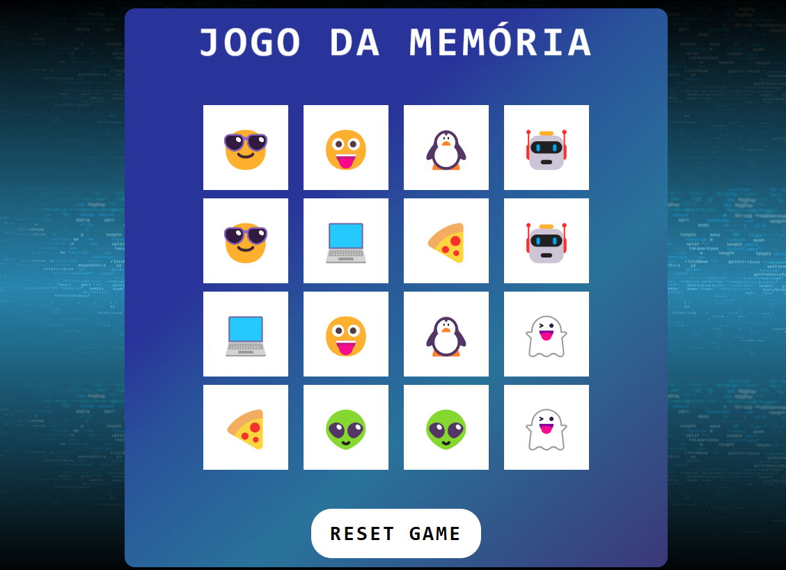

<h1 align="center"><strong>Memory Game</strong></h1>

# Jogo da Memória - Versão Inicial (HTML, CSS, JavaScript Puro)

**Visão Geral**

Este é um projeto de um clássico Jogo da Memória desenvolvido utilizando apenas HTML, CSS e JavaScript puro. O objetivo do jogo é encontrar todos os pares de cartas correspondentes o mais rápido possível, virando duas cartas por vez.

**📍Funcionalidades Principais**

* **Interface de Jogo:** Uma grade de cartas dispostas aleatoriamente na tela.
* **Mecânica de Virar Cartas:** O jogador pode clicar em uma carta para revelar o emoji escondido.
* **Verificação de Pares:** Ao virar duas cartas, o jogo verifica se os emojis são correspondentes.
* **Cartas Combinadas:** Pares de cartas correspondentes permanecem virados.
* **Reset do Jogo:** Um botão para reiniciar o jogo, embaralhando as cartas novamente.
* **Animação de Vitória:** Ao encontrar todos os pares, uma animação de fogos de artifício é exibida, juntamente com uma mensagem de parabéns.

## 📂Estrutura de Arquivos
```
memory-game/
│
├── src/
│   ├── scripts/
│   │   └── engine.js
│   ├── styles/
│   │   ├── main.css
│   │   ├── reset.css
│   │   ├── responsive.css
│   │   └── styles.css
│   └── img.svg
│       
├── .gitignore
├── index.html
├── License
└── readme.md

```
* `index.html`: A estrutura HTML da página do jogo, contendo o título, a área do jogo e o botão de reset.
* `src/styles/`: Contém os arquivos de estilo CSS.
    * `styles.css`: Os estilos principais para a aparência e o layout do jogo.
    * `reset.css`: Estilos para resetar as configurações padrão dos navegadores.
    * `responsive.css`: Estilos específicos para adaptar o layout a diferentes tamanhos de tela (mobile).
* `src/scripts/`: Contém o arquivo JavaScript com a lógica do jogo.
    * `engine.js`: A implementação da mecânica do jogo, incluindo a criação das cartas, a lógica de virar, a verificação de pares e a animação de vitória.

## 🕹️Como Jogar

1.  Ao carregar a página, as cartas serão exibidas viradas para baixo.
2.  Clique em uma carta para revelar o emoji.
3.  Clique em outra carta para tentar encontrar o par correspondente.
4.  Se os emojis das duas cartas forem iguais, o par é encontrado e as cartas permanecem viradas para cima.
5.  Se os emojis não forem iguais, as cartas são viradas para baixo novamente após um breve período.
6.  Continue virando as cartas até encontrar todos os pares.
7.  Ao encontrar todos os pares, uma animação de fogos de artifício será exibida com uma mensagem de parabéns.
8.  Clique no botão "RESET GAME" para iniciar um novo jogo com as cartas embaralhadas.

## 🛠️Tecnologias Utilizadas
<div>
<a href="https://en.wikipedia.org/wiki/HTML5" target="_blank"></a>
<a href="https://www.w3schools.com/css/" target="_blank"></a>
<a href="https://www.javascript.com/" target="_blank"></a> 
</div>

## Créditos

Este projeto foi desenvolvido como parte do aprendizado no curso **Ri Happy - Front-end do Zero da <a href="https://web.dio.me/">DIO</a>**.


<p align="center">
  
</p>

## Observações
* Esta é a primeira versão do jogo, desenvolvida com **HTML**, **CSS** e **JavaScript** puro.
* O código desta versão foi arquivado na branch ``first-version`` e não será mesclado com a branch principal (``main``).

## 📜Licença
Este projeto está sob a [licença MIT](./License).

## ✨ Developer
👨‍💻 Este projeto foi desenvolvido por <strong>Bruno Teixeira</strong> como parte do meu portfólio de desenvolvimento Front-End. Sinta-se à vontade para entrar em contato ou contribuir com o projeto!

- [](https://www.linkedin.com/in/brunotxrs/)

- [](https://github.com/brunotxrs)

-----------------------------------